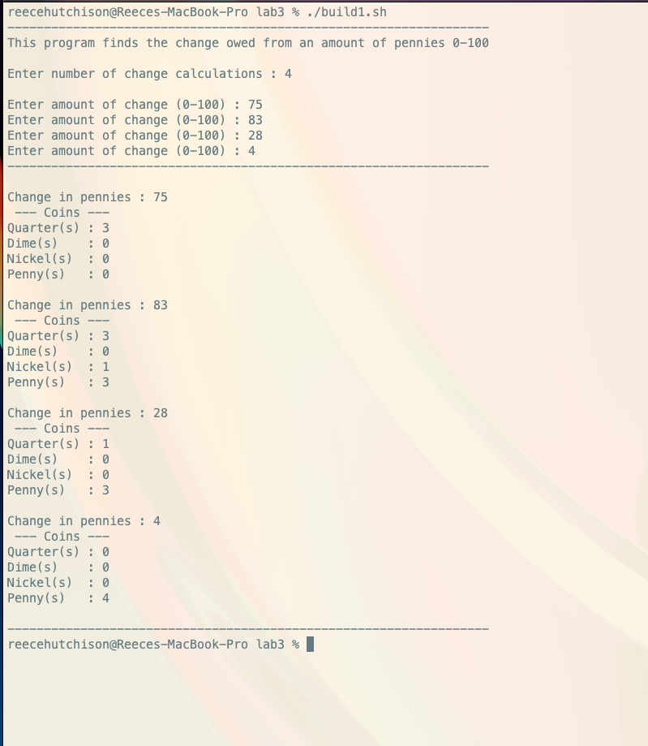

#Program One

instructions to build in a unix enviornment : 
    1. chmod -x build1.sh     --> this will add an exe attribute to the file
    2. ./build1.sh            --> will build and execute the program

    alternativly if you want to build the program and execute the test set : 
    1. build the program with the instructions above
    2. run through or terminate the program with ctrl c
    3. ./change_calculator < test1.txt

